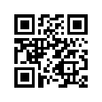

# iSPA Element UI

A Component Library for VueJs (Vue 3) base on Tailwind Css.

<p align="center">
  <a href="https://npmcharts.com/compare/ispa-element?minimal=true"></a>
  <a href="https://www.npmjs.com/package/ispa-element"></a>
  <a href="https://m.me/malayvuong"></a>
</p>

## Quick Start
To use it, open up your terminal in the desired directory and run the following command:

```sh
npm install ispa-element
```

## Module Loader
This is the recommended way if your application uses vue-cli or has a webpack based build with vue-loader configured. Import the components as .vue files for seamless integration within your project where path of each component is available at the "import" section of a component documentation.
```js
//  import ComponentName from 'ispa-element/componentname';
impot Button from 'ispa-element/button';
```
In the next step, register the component with the tag name you'd like to use.

```js
import {createApp} from 'vue';
const app = createApp(App);

app.component('i-button', Button);

app.mount('#app');
```
::: tip Note
You can use any tag name, but notes these tag name maybe conflict with others tag name, so make sure it's unique tag name to use.
:::

# Documentation
Please [visit here](https://ispa.io/docs/ispa-element/components/) to read full documents of iSPA Element.

# Special Thanks
Thanks for amazing library [PrimeVue](https://primefaces.org/primevue/showcase/#/), our first version has been inspired from this library.

## Milestone

- [x] Button Component
- [ ] Card Component
- [ ] Loading Component/Directives
- [ ] Dropdown Component
- [ ] Alert Component
- [ ] Badge Component
- [ ] Nav/Tabs Component
- [ ] Progress bar Component

## Versioning

Maintained under the [Semantic Versioning guidelines](https://semver.org/).

## License

[MIT](https://opensource.org/licenses/MIT) © [Malayvuong](https://malayvuong.com/)

## Invite me a cup of coffee
If you like this project and want to contribute us, then you can send us a cup of coffee by this ways below:

| PAYPAL.ME            | MOMO App (Vietnam) |
|:--------------------:|:------------------:|
|  |  |

[⬆ back to top](#ispa-element-ui)
